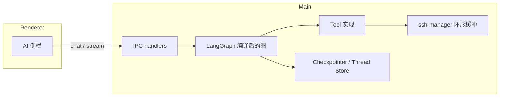

# AI-SSH-Pro：基于 LangGraph（JS）的智能对话 — 产品与方案

| 项目 | 说明 |
|------|------|
| 文档版本 | v0.1 |
| 依赖方向 | `@langchain/langgraph` + `@langchain/core`（及与 OpenAI 兼容的 Chat 模型适配） |
| 与现有方案关系 | 在《技术方案-方案B》主进程 Agent 预留基础上，将「单次 JSON 回复」演进为「有状态图 + 工具」 |

---

## 第一部分：产品 —— 更智能、更强大指什么

### 1.1 现状与痛点（基线）

当前侧栏对话以 **单轮/多轮文本 + 强制 JSON** 为主：模型一次性给出说明、可选命令与风险等级。这对「问一句、答一块」足够，但对复杂问题存在明显边界：

- **缺少显式任务结构**：用户一大段诉求时，模型容易混在一起回答，难以跟踪「做到哪一步」。
- **缺少可控的多步推理**：不能稳定地「先规划 → 再取终端上下文 → 再给命令 → 再解释风险」。
- **工具边界模糊**：终端片段靠勾选附带，模型无法按需、多次、有纪律地「索取」上下文。
- **会话与记忆**：多标签、多 SSH 场景下，长期偏好与项目级事实难以沉淀，换会话后重复交代。

### 1.2 产品目标（用户可感知）

| 能力维度 | 用户看到的效果 | 与「更智能」的关系 |
|----------|----------------|-------------------|
| **任务拆解** | 助手先给出步骤清单（可勾选/可折叠），再按步骤推进，未完成项一目了然 | 从「一段话」升级为「可执行计划」 |
| **多步 Agent** | 同一用户问题下，后台可经历多节点（规划、检索终端、生成命令、自检），前端仍是一条连贯回复流（可附带阶段标签） | 复杂问题成功率提升，减少「漏看终端」 |
| **工具化终端** | 模型在允许范围内 **请求最近 N 行输出 / 当前会话元数据**，而不是仅靠用户手动勾选 | 上下文更准，用户操作更少 |
| **线程化对话** | 侧栏支持 **多个对话线程**（按项目、按故障单、按会话），互不污染 | 符合专业用户工作方式 |
| **长期记忆（可控）** | 用户确认后写入「偏好与事实」（如常用发行版、禁止执行的命令类型、项目路径约定），后续自动注入 | 越用越省事，且 **默认需确认** 避免乱记 |

### 1.3 「更强大」的边界与安全原则（产品承诺）

- **默认不自动执行远程命令**：与现版一致，高危操作必须在文案与 UI 上要求确认；LangGraph 只增强「推理与信息获取」，不改变「执行权在人」的默认。
- **工具白名单**：初期仅开放只读类工具（如 `get_terminal_snapshot`、`list_active_sessions`），写入类能力（若未来有）必须单独开关与审计日志。
- **可解释**：可选展示「当前阶段」（规划 / 读终端 / 生成建议），满足专业用户调试与信任需求。

### 1.4 典型用户故事（验收口径）

1. **复杂排错**：用户粘贴多屏报错 + 自然语言目标 → 助手输出子任务列表 → 自动拉取当前标签终端尾部 → 给出分级风险命令与回滚说明。
2. **多会话对比**：用户问「两个 SSH 里版本是否一致」→ 工具分别读取两个 session 的快照（在用户授权范围内）→ 结构化对比结论。
3. **长期偏好**：用户声明「我是 Debian，不要用 yum」→ 确认写入记忆 → 后续命令建议默认遵循。

---

## 第二部分：技术 —— 如何用 LangGraph（JS）落地

### 2.1 为什么选 LangGraph（相对自研循环）

| 对比项 | 自研 while+messages | LangGraph StateGraph |
|--------|---------------------|----------------------|
| 状态形状 | 易散落成全局变量 | **Annotated state** 统一管理 |
| 分支与重试 | if/else 难维护 | **条件边**、**中断/恢复** 一等公民 |
| 多步工具 | 手写 ReAct | **ToolNode** + 预置 agent 模式 |
| 可观测 | 自建日志 | **节点级事件**，便于对接现有 `ai:stream` |
| 未来扩展 | 子流程难复用 | **Subgraph** 封装子能力 |

### 2.2 在方案 B 中的部署位置

与《技术方案-方案B》一致：**图与工具运行在 Electron 主进程（Node）**，渲染进程仅通过 **IPC** 发起 `threadId + userMessage`、订阅流式事件。

### 2.3 建议的状态（State）草图

> 具体字段名在实现期可按 `@langchain/langgraph` 的 `Annotation` API 微调，此处表达语义。

- **messages**：对话消息列表（含 `HumanMessage` / `AIMessage` / `ToolMessage`）。
- **plan**：结构化子任务数组（标题、状态、简述）—— 可由独立「规划节点」写入。
- **targetSessionId**：当前用户选中的 SSH 会话（由 IPC 传入，工具只读使用）。
- **memorySnippet**：从本地 store 读取并经裁剪注入的「长期记忆」文本（不含密钥）。

### 2.4 图（Graph）分期设计

**阶段 A（MVP，优先上线）**

1. **load_context**：组装 system（运维助手人设 + 记忆片段 + 会话 ID）。
2. **agent**：绑定白名单工具的单 ReAct 风格节点（或 `createReactAgent` 等价物）。
3. **tools**：`ToolNode` 执行只读工具。
4. **format_reply**：将最终 AIMessage 转为与现版兼容的 **JSON 外壳**（`description` / `command` / `riskLevel` / `notes`），便于现有 `AIPanel` 少改即可渲染；额外字段（如 `subtasks`）可并行扩展。

**阶段 B**

- 独立 **planner** 节点：先产出 `plan`，再进入 agent；前端展示计划卡片。
- **Subgraph**：例如「仅做日志归纳」「仅做命令生成」复用在不同入口。

**阶段 C**

- **Checkpointer 持久化**：线程级 checkpoint 落盘（electron-store 或独立 JSON），支持崩溃恢复与「回到某步」调试（可选，偏内部）。

### 2.5 工具（Tools）与 SSH 集成

| 工具名（示例） | 作用 | 安全级别 |
|----------------|------|----------|
| `get_terminal_snapshot` | 读取指定 `sessionId` 环形缓冲尾部 N 行 | 只读；sessionId 必须来自 IPC 白名单或当前选中 |
| `get_active_session_meta` | 主机、用户、连接状态等非秘密元数据 | 只读 |
| （预留）`propose_command` | 不执行，仅把建议写入 state，由 format 节点统一 JSON 化 | 逻辑只读 |

工具实现 **直接调用现有** `SshSessionManager`，不经过渲染进程，避免泄露密钥。

### 2.6 模型与调用链

- 继续使用 **OpenAI 兼容** `fetch` 路径（与现 `ai-stream.ts` 一致）或逐步接入 **`@langchain/openai` / 社区兼容适配器**（实现期二选一，以打包体积与类型体验为准）。
- **流式**：LangGraph 的 `streamEvents` 或节点流式输出映射到现有 `ai:stream` 通道（`delta` / `done` / `error`），避免重写整块 UI。

### 2.7 线程（多会话对话）与存储

| 概念 | 存储位置 | 说明 |
|------|----------|------|
| `thread_id` | 主进程生成 UUID；渲染进程维护当前选中线程 | 与 SSH `sessionId` 解耦 |
| 消息列表 / checkpoint | `electron-store` 或 `userData` 下 JSON | 控制单线程最大消息数与单条大小 |
| 长期记忆 | 独立 key；仅保存用户确认后的短条目 | 定期裁剪与去重 |

### 2.8 依赖与工程注意事项

- **新增依赖**（计划）：`@langchain/langgraph`、`@langchain/core`；视模型适配增加 `@langchain/openai` 等。
- **Electron 打包**：主进程 bundle 需把 LangChain 相关包打入 `out/main`；注意 **不要用仅浏览器可用的 API**。
- **体积**：若主包过大，可评估将图与工具单独 `out/main/agent-*.js` 动态 import，或后续拆 **子进程**（协议不变）。

### 2.9 风险与缓解

| 风险 | 缓解 |
|------|------|
| 模型乱调工具 | 工具白名单 + 参数校验 + 最大调用次数 |
| 无限循环 | `recursionLimit` / 最大步数；超时中断 |
| 记忆污染 | 仅用户确认写入；展示「将记住的内容」摘要 |
| 与旧 UI 不兼容 | `format_reply` 保证最小 JSON 字段与现解析器一致 |

### 2.10 实施顺序建议（里程碑）

1. **M1**：主进程引入 LangGraph，跑通「单线程 + 一工具 + 流式 IPC」，UI 仍显示单条助手回复。
2. **M2**：规划节点 + `subtasks` 展示；线程列表与持久化。
3. **M3**：长期记忆确认流 + 记忆注入；可观测「阶段」开关。

---

## 第三部分：文档维护

- 实现落地后，将本文 **版本号** 与 **里程碑状态** 在 PR 中同步更新。
- 若与《技术方案-方案B》冲突，以 **安全默认与主进程工具边界** 为准；架构图可在方案 B 中增加「LangGraph 子模块」交叉引用。

---

## 参考链接（外部）

- [LangGraph JS 概览](https://docs.langchain.com/oss/javascript/langgraph/overview)  
- [ToolNode（预置）](https://langchain-ai.github.io/langgraphjs/reference/classes/langgraph_prebuilt.ToolNode.html)  
- [Subgraphs](https://docs.langchain.com/oss/javascript/langgraph/subgraphs)
