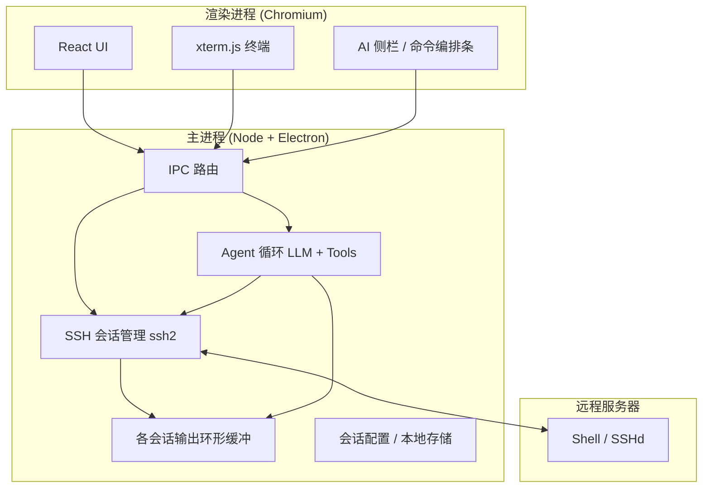

# AI-SSH-Pro 技术方案（方案 B：全 TypeScript / Electron）

| 项目 | 说明 |
|------|------|
| 文档版本 | v0.1 |
| 适用架构 | 方案 B：Electron 主进程承载 SSH + Agent，无独立 Python 运行时 |
| 目标产品 | 类 Xshell 的多会话 SSH 客户端，集成 AI 对话与可控命令辅助 |

---

## 1. 背景与目标

### 1.1 背景

运维与开发人员需要在 Windows 上管理大量 SSH 会话（会话树、多标签、终端体验接近专业终端模拟器），同时希望用自然语言完成「生成命令、解释输出、归纳日志」等任务，并在未来演进为具备工具调用能力的 Agent。

### 1.2 目标

- **终端优先**：日常操作仍以真实 Shell 为主，AI 不抢占主工作区。
- **单栈交付**：单一仓库、TypeScript 为主，降低构建与协作成本。
- **安全默认**：敏感凭据不进入渲染进程；高危操作需人工确认后再写入 PTY。
- **可演进**：预留与 MCP（Model Context Protocol）对接的能力，便于后续扩展工具与外部系统。

### 1.3 非目标（首版）

- 不要求首版即实现「全自动无人值守」在远程机上的任意操作。
- 不承诺与 Xshell 功能 1:1 对齐（可分期实现 SFTP、端口转发等）。

---

## 2. 架构总览

### 2.1 逻辑分层



### 2.2 方案 B 的核心取舍

| 选择 | 说明 |
|------|------|
| **SSH 与 PTY 在主进程** | 与 `ssh2`、密钥、会话生命周期同进程，避免凭据进入渲染层。 |
| **Agent 在主进程（或同技术栈子进程）** | 工具可直接访问会话 Map、环形缓冲；若日后隔离，可拆为 Node 子进程，协议保持不变。 |
| **渲染进程只做 UI 与 xterm** | 通过 `contextBridge` 暴露受限 API，禁止任意 Node 能力暴露给前端。 |

---

## 3. 技术选型

| 领域 | 选型 | 说明 |
|------|------|------|
| 桌面壳 | **Electron** | 成熟、xterm 集成资料多、Windows 分发链路清晰。 |
| 界面 | **React + TypeScript + Vite** | 与 electron-vite 等工具链匹配良好。 |
| 终端 | **@xterm/xterm + addon-fit** | 与主进程字节流双向绑定。 |
| SSH | **ssh2**（仅 main） | 流式 shell channel，与终端尺寸、环境变量协同。 |
| 本地存储 | **electron-store** 或 JSON（userData） | 保存会话树、窗口状态、非密钥配置。 |
| LLM 调用 | **Vercel AI SDK** 或 **@anthropic-ai/sdk** 等 | 流式输出、工具调用结构清晰；具体厂商可配置。 |
| 后续扩展 | **@modelcontextprotocol/sdk** | MCP Client 与工具注册可在主进程实现。 |

---

## 4. 进程职责划分

### 4.1 渲染进程

- 会话树、多标签、布局（左侧栏 + 终端区 + 可选右侧 AI）。
- xterm 的输入输出与主进程同步；窗口 resize 时同步 **cols/rows** 到 SSH。
- AI 对话 UI：展示流式回复、建议命令块、「插入终端 / 确认执行」按钮。
- **不**直接持有密码、私钥明文；仅传递用户操作意图与已通过 UI 脱敏的配置引用。

### 4.2 主进程

- 创建/关闭 SSH 连接；维护 `sessionId → { client, stream, meta }`。
- 维护 **每会话输出环形缓冲**（例如最近 N KB 或 N 行，可配置），供 Agent 工具读取。
- 执行 **Agent 循环**：请求模型 → 解析 tool calls → 执行工具 → 将结果写回对话上下文。
- 负责写入 PTY 的 **最终闸门**（例如需带 `confirmed: true` 或走权限策略）。
- 读写本地会话列表（主机、端口、用户名、密钥路径等）。

### 4.3 Preload

- 使用 `contextBridge.exposeInMainWorld` 暴露稳定、小面积的 API（如 `ssh.*`、`ai.*`、`settings.*`）。
- 所有通道使用结构化消息，避免 `executeJavaScript` 式宽接口。

---

## 5. SSH 与会话模型

### 5.1 会话标识

- 每个已连接标签页对应唯一 **`sessionId`**（UUID）。
- 会话元数据建议包含：`host`、`port`、`username`、`connectedAt`、`termCols`、`termRows`、可选 `label`（展示名）。

### 5.2 连接与 Shell

- 使用 `ssh2` 建立连接后开启 **interactive shell**，`term` 与 xterm 一致（如 `xterm-256color`）。
- **流数据**：`stream.on('data')` → 追加环形缓冲 → `webContents.send` 到对应渲染窗口/路由到当前标签。
- **用户输入**：xterm `onData` → IPC → `stream.write`。
- **断开**：清理缓冲、通知 UI、Agent 侧该 `sessionId` 工具不可用。

### 5.3 会话持久化（非连接状态）

- 「会话配置」与「当前连接」分离：配置可保存；连接需用户主动发起或恢复策略另行定义。

---

## 6. 终端输出与 Agent 上下文

### 6.1 环形缓冲（Ring Buffer）

- **目的**：在不全量上传 scrollback 的前提下，为模型提供「最近输出」上下文。
- **建议**：按行或按块存储，上限可配置；超过部分丢弃最旧数据。
- **注意**：缓冲中可能含敏感信息；Agent 请求前应提示用户，并支持「仅选中片段」模式。

### 6.2 显式上下文（推荐默认）

- **用户选中终端文字** + 用户问题 → 优先于全缓冲。
- **「最近 N 行」** 由用户或快捷键触发，避免默认把密码行送入模型。

---

## 7. Agent 设计（主进程）

### 7.1 循环形态

1. 收集：用户消息 + 可选 `sessionId` + 可选 `terminal_excerpt`。
2. 调用 LLM（支持 tools / function calling）。
3. 对 tool 结果执行本地实现（读缓冲、写 PTY、读元数据）。
4. 将 tool 输出压缩后再次送入模型，直到模型结束或达到步数/预算上限。

### 7.2 首期工具集（示例）

| 工具名 | 作用 | 风险 |
|--------|------|------|
| `get_terminal_snapshot` | 读取指定 `sessionId` 的环形缓冲片段 | 中（可能含敏感数据） |
| `get_session_meta` | 返回 host/user/shell 提示等元数据 | 低 |
| `propose_run_command` | 仅生成建议，**默认不执行** | 低 |
| `run_command` | 向 PTY 写入一行并可选等待提示符 | **高**，需确认策略 |

### 7.3 人工确认策略

- **默认**：模型建议的命令 → UI 展示 → 用户点击「插入终端」后自行回车，或「确认执行」由主进程 `stream.write` + `\n`。
- **高危关键词**（如 `rm -rf`、`mkfs`、`dd`、`curl ... | sh` 等）：强制二次确认或禁止自动执行（可配置）。
- **步数上限**：单轮用户请求内 Agent 最大 tool 轮次，防止死循环与费用失控。

---

## 8. IPC 约定（概要）

以下为方向性约定，实现时可细化为 TypeScript 类型共享包（如 `packages/shared-types`）。

### 8.1 渲染 → 主进程

- `ssh:connect` / `ssh:disconnect` / `ssh:write`
- `ssh:resize`（cols, rows）
- `ai:chat`（payload：messages、targetSessionId、options）
- `sessions:save` / `sessions:list`（不涉及明文密钥落盘策略需单独评审）

### 8.2 主进程 → 渲染

- `ssh:data`（sessionId, chunk）
- `ssh:status`（connected / error / closed）
- `ai:stream`（delta / tool-call / done）
- `agent:needs_confirmation`（command, sessionId, riskLevel）

具体通道可用 `ipcMain.handle` + `ipcRenderer.invoke`，流式事件用 `webContents.send` 配合 `sessionId` 路由。

---

## 9. 配置与密钥

### 9.1 模型与 API

- API Key 建议存放：**系统密钥环**（如 `keytar`）或加密本地文件，由主进程读取；环境变量仅用于开发。
- 支持配置：`baseURL`、`model`、`maxSteps`、`temperature` 等。

### 9.2 SSH 认证

- 支持密码、私钥路径、以及后续 agent forwarding 等可分期实现。
- 私钥路径与口令：仅主进程使用；渲染进程只显示「已配置」状态。

---

## 10. 安全与合规

- **最小权限**：渲染进程无 Node、无 `remote`。
- **审计日志（可选）**：记录「用户确认执行的命令 + sessionId + 时间」，不含 API Key。
- **供应链**：锁定依赖版本；发布前 `npm audit`。
- **企业场景**：后续可接 SSO、策略服务器，本文档不展开。

---

## 11. 打包与分发

- **electron-builder**：生成 NSIS 安装包或便携目录；配置 `artifactName`、图标、签名（Windows Authenticode）。
- **自动更新**：可选 `electron-updater`，需托管更新元数据与差分包策略。
- **架构**：Windows x64 为主；与原生模块（若有）保持一致。

---

## 12. 目录结构建议

```
ai-ssh-pro/
  electron.vite.config.ts   # 或等价构建配置
  src/
    main/                   # 主进程：ssh、agent、ipc、store
    preload/
    renderer/               # React + xterm + 页面组件
  packages/                 # 可选：共享类型与 prompt 模板
  docs/
    技术方案-方案B.md
```

---

## 13. 迭代里程碑（建议）

| 阶段 | 内容 |
|------|------|
| M1 | 会话列表 + 单会话 SSH + xterm 双向 + 多标签骨架 |
| M2 | 右侧 AI 对话 + 流式回复 + 「插入终端」 |
| M3 | 环形缓冲 + `get_terminal_snapshot` + 解释选中/最近输出 |
| M4 | Tool 循环 + 确认执行 + 高危策略 + 步数上限 |
| M5 | MCP Client 试点（只读工具优先） |

---

## 14. 风险与对策

| 风险 | 对策 |
|------|------|
| LLM 建议危险命令 | 确认闸门 + 关键词策略 + 默认插入不自动执行 |
| Token 费用与延迟 | 限制缓冲长度、限制步数、本地小模型可选（后续） |
| 终端与 SSH 编码/宽字符 | 统一 UTF-8；xterm 与 shell `LANG` 对齐 |
| Agent 逻辑复杂后主进程阻塞 | 将 Agent 拆为 Node worker thread 或子进程，保持 IPC 不变 |

---

## 15. 附录：与方案 A（Python + Electron）的关系

本方案不引入 Python 运行时，Agent 与工具均在 Node/TS 侧实现。若未来需对接企业内仅提供 Python 的库，可通过 **子进程调用小型 CLI** 或 **HTTP 侧车** 局部补充，而不必整体迁移为方案 A。

---

## 修订记录

| 版本 | 日期 | 说明 |
|------|------|------|
| v0.1 | 2026-04-02 | 初稿：方案 B 架构、选型、Agent、IPC、安全与里程碑 |
